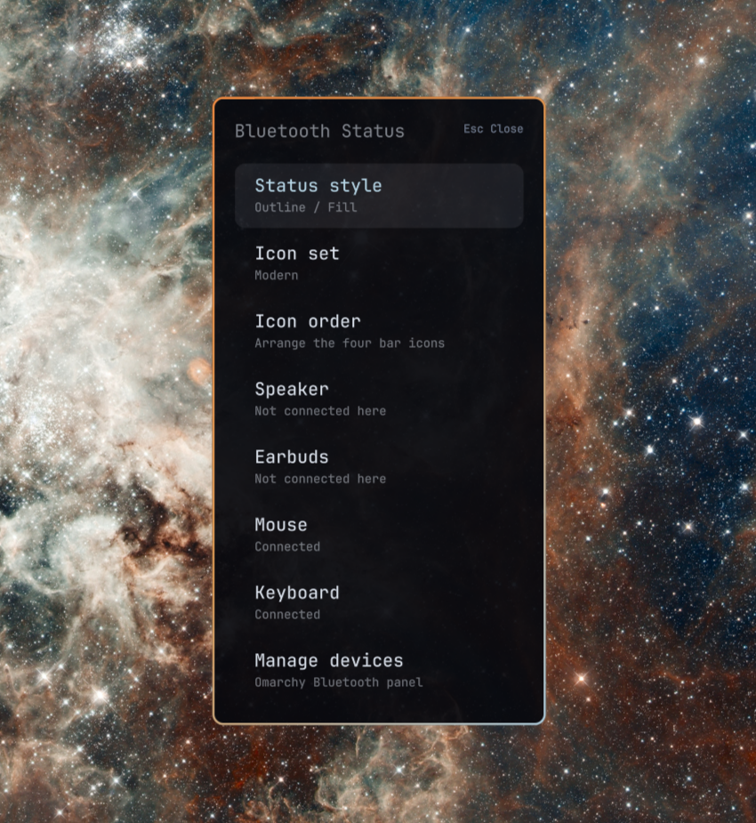
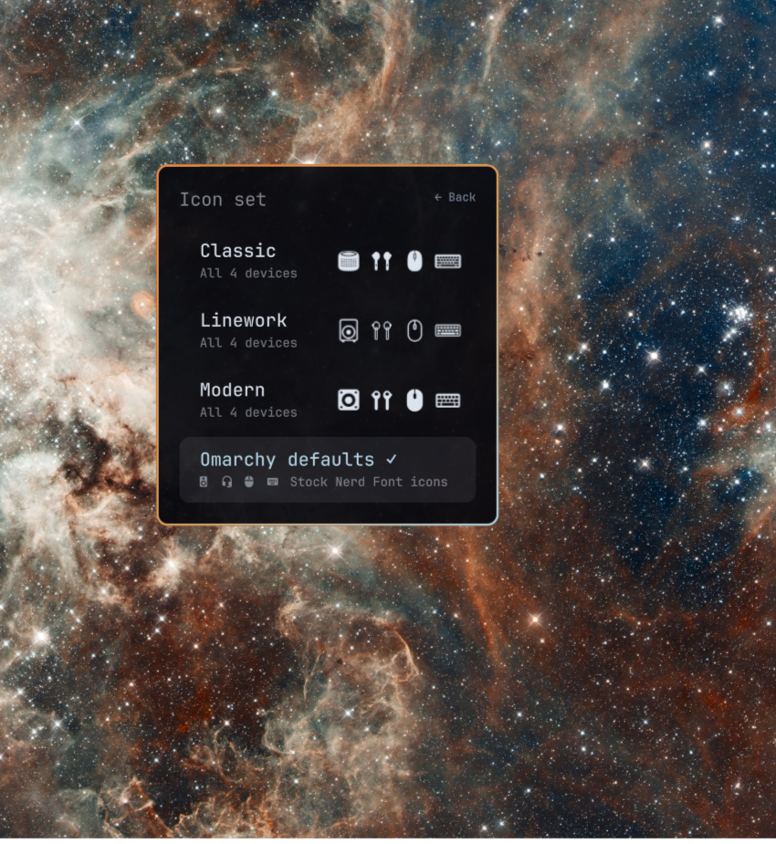

# Omarchy Bluetooth Status Plugin

One Omarchy bar plugin for a Bluetooth **speaker**, **earbuds**, **mouse**, and **keyboard**. Each indicator tracks a paired device by Bluetooth address and changes when that device connects to or disconnects from this computer. The settings panel controls appearance and visibility; Omarchy's built-in Bluetooth panel handles pairing and connections.





The previews show the centered Omarchy plugin panel and icon choices without device names or Bluetooth addresses.

## Install

Requires Omarchy with the Quickshell plugin system, BlueZ, `bluetoothctl`, `jq`, and `flock`. Pair devices in Omarchy's Bluetooth panel first. Install with Omarchy's native plugin command:

```sh
omarchy plugin add https://github.com/redeye1011/omarchy-bluetooth-status-plugin.git --enable
```

The plugin initially shows a setup icon when none of the four indicators is visible. Select it to open Bluetooth Status, then choose the paired device for each slot. You can also open settings at any time with:

```sh
omarchy-shell shell summon redeye1011.bluetooth-status '{}'
```

For an optional **Setup → Bluetooth Status** entry in Omarchy search, run:

```sh
~/.config/omarchy/plugins/redeye1011.bluetooth-status/bin/menu-extension add
```

This creates one search result for the panel; individual settings are inside it. The optional command writes only its own marked entry to `~/.config/omarchy/extensions/omarchy-menu.jsonc`.

## Choose how the icons look

The panel offers a shared **Status style** and **Icon set**, plus an **Icon** choice for each device. If individual choices differ, the Icon set summary reads **Mixed**. **Omarchy defaults** restores the original glyph for each slot. The Classic, Linework, and Modern sets each include base, filled, and outlined artwork for all four devices.

The bar shows each device as its own spaced icon. Open **Icon order** to move any icon left or right; the four icons can be arranged in any order. Omarchy still treats the group as one bar widget, which you can drag to a different place on the bar.

| Status style | Connected | Disconnected | Unconfigured |
| --- | --- | --- | --- |
| Red / Green | Theme green icon | Theme urgent/red icon | Muted icon |
| Outline / Fill | Filled artwork | Outlined artwork | Muted icon |
| Monochrome Squares | Black icon in a white filled square | Theme-colored icon in a hollow square | Muted icon |

Speaker and earbuds icons are hidden when disconnected by default; mouse and keyboard remain visible. Each slot has its own **Show when disconnected** setting. A setup icon remains available if all four status icons are hidden. A connected Bluetooth device may still be using a different audio output; this plugin reports the connection, not audio routing. Battery percentage appears in a tooltip when BlueZ supplies it.

Outline / Fill uses the Linework artwork when an Omarchy or custom glyph is selected, since some glyphs have no matching outline variant.

Click a status icon to open Omarchy's Bluetooth panel. In the settings panel, **Manage devices** opens the same built-in panel. Press **Left** or **Backspace** to go back. Pair new devices in Omarchy's Bluetooth panel before assigning them here. If a tracked device is forgotten and paired again under a new address, the plugin updates the binding when it can identify one connected replacement. If more than one device matches, choose the replacement in **Tracked device**.

## Update or remove

```sh
omarchy plugin update redeye1011.bluetooth-status
omarchy plugin remove redeye1011.bluetooth-status
```

If you added the optional search entry, remove it before uninstalling:

```sh
~/.config/omarchy/plugins/redeye1011.bluetooth-status/bin/menu-extension remove
```

### Migrating from the earlier five-plugin bundle

Install the native plugin with the command above, then run:

```sh
~/.config/omarchy/plugins/redeye1011.bluetooth-status/bin/migrate-from-bundle
```

The migration backs up `shell.json`, copies the four device assignments, icons, shared status style, and visibility settings into the new plugin, updates the owned search entry, then removes the earlier managed plugin folders through Omarchy. It refuses to remove a plugin folder it does not own. Review the backup path printed by the script before deleting any backups.

## Development and provenance

Run `./tests/run.sh` to validate the manifest, icon shapes, QML syntax, device matching, and settings behavior. The test suite requires ImageMagick and Qt's `qmlformat`. A live desktop check is needed to verify the panel and bar display. Plugin code runs with your user account's privileges inside `omarchy-shell`; inspect it before enabling it.

The 36 Classic, Linework, and Modern PNGs were created by `redeye1011` for the companion macOS Bluetooth Status project and match its commit `2cf2c04`. They are included under this repository's [MIT license](LICENSE). No real Bluetooth addresses, credentials, or personal device names are stored in this repository; tests use invented device identities.
